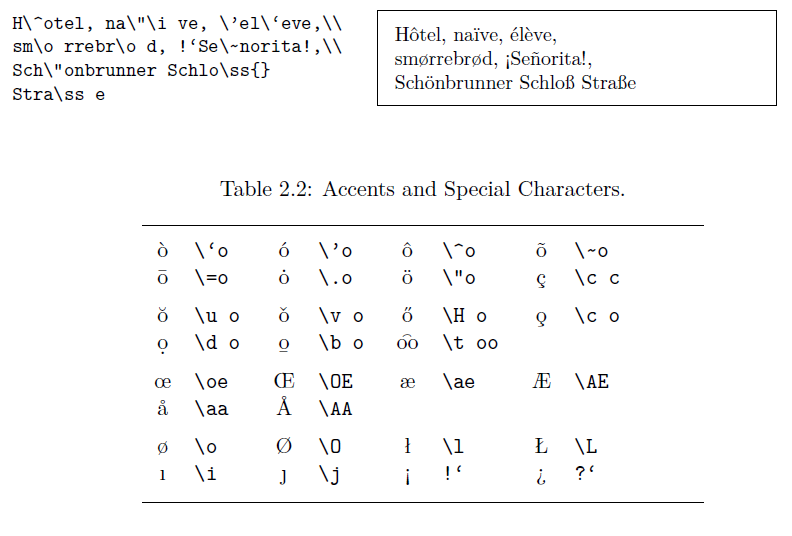

# 论文写作规范

## 一、Overleaf 项目命名规范

Overleaf 网站上的论文项目名统一按照该格式命名：**姓名\_标题\_类型\-0?x\_年月**

1. **姓名**：英文，姓用全拼，名用首字母
2. **标题**：关键词的首字母缩写
3. **类型0x**：
   - 论文初稿：paper
   - 论文修订稿：revision
   - 审稿意见回复：response
   - 论文终稿：final
   - 后面的0?表示第?篇论文，x表示第x个版本（a、b、c以此类推）。
4. **年月**：2位年份\+2位月份

> 例：Y\.Nie\_EM\-SDPD\_revision\-03a\_2409，或 Z\.Wang\_DRL\-AF\_paper\-02b\_2407
> 

## 二、内容

### 1. 术语、符号与缩写

#### 1.1 数学符号

- 数学符号在文中第一次出现要给出相应的定义，位置可以是出现之前，

    > 例：Define $x \triangleq \cdots$, 
    > 
    
    也可以是出现之后不远的地方。
    
    > 例：where $x$ denotes ...
    > 

#### 1.2 缩写

- 第一次出现，要给出全称\+缩写，之后出现，只用缩写即可

    > 例：particle filter (PF)\.\.\.\.\.\.PF\.\.\.\.\.\.
    > 
    
- 对上一条的补充：摘要中出现的全称\+缩写，正文中不能直接用缩写，要重新定义

- 全称的首字母可以大写也可以不大写，但是在一篇论文中要统一

    > 例：support vector machine (SVM) 或 Support Vector Machine (SVM)
    > 
    
- 上一条的补充：以人名命名的术语、专有名词在任何情况下都要大写，

    > 例：Kalman filter (KF)、Internet of Things (IoT)
    > 

### 2. 交叉引用

- 所有的section x里的x都必须要通过`\label{yy}`、`\ref{yy}`命令引用，不可以手打，以养成良好写作习惯。

### 3. LaTeX格式与排版细节

#### 3.1 公式

`\begin{equation*}\end{equation*}`公式不要加`\lable{}`，避免编译不干净。

#### 3.2 模板环境

如果投稿IEEE Trans的期刊，请不要使用其他自己添加的命令，而是用原模板自带证明命令：

```latex
\begin{IEEEproof} 
...
\end{IEEEproof}
```

#### 3.3 英文标点与特殊符号

引号、破折号、非英文字符等，请用Latex命令，而不是直接用中文系统里的字符。

1. **引号**：``` <quoted text here>''`

2. **破折号**：英文中的 em-dash，LaTeX代码`---`；

3. **表示范围的短横线**：英文中的en-dash，LaTeX代码`--`；

4. **单词内的连字符**：英文中的hyphen，LaTeX代码`-`；

5. **非英文字符**：如下表



### 4. 行文风格

- 避免xxx\-which xxx\-xxx的AI风格额表述。
- 保证行文简洁清晰、直达要点，避免空话、重复表达。写完关键句后，可将其用翻译软件直译回中文进行核对，确认译文与自己想表达的意思一致。

## 三、参考文献

#### 代码

```LaTeX
\begin{thebibliography} {00}  

\bibitem{xxx}
xxx...

\bibitem{Chang-TAC-1984}
C.~Chang and J.~Tabaczynski, Application of state estimation to target tracking, \textit{IEEE Transactions on Automatic Control}, vol.~29, no.~2, pp.~98--109, 1984.

\bibitem{xxx}
xxx...

\end{thebibliography}
```

#### 规则说明

1. ##### 作者

   - 名用大写首字母+「.」，姓用全拼，之间用「~」连接
   - 两个作者：第二个作者前的「and」前不加「,」
   - 三个及以上作者：最后一个作者前的「and」前也要加「,」

2. ##### 标题

   - 句首单词首字母大写，专有名词首字母大写，其余单词首字母小写
   - 前后加引号（「\`\`」和「''」），标题末尾的「,」在引号内【上述引号可以不用加，2025.12.6】

3. ##### 期刊

   - 斜体，用`\textit{}` 
   - 每个单词首字母大写，介词、连词等小写

4. ##### 卷/期/页/年

   - 用「~」连接，如`vol.~29`。

5. ##### 排序

   - 参考文献请按alphabetical order排序，即按照名字首字母进行排序

## 四、其他

- 通讯作者应在提交终稿时进行标注，投稿、修订稿中不必标注。

    > 例：`{\it Corresponding author: Qinyuan Liu}` *Corresponding author: Qinyuan Liu*
    > 
    
- 基金内容应在提交终稿时进行确认与更新。

- 个人简介在投稿时视刊物要求添加，如不要求则不添加。

- 如需添加个人简介，个人照片应为eps格式，不应超过2M。

- 论文版本中的左上角版本应该按照不同的类型进行相应的调整。

    > 例：`\markboth{\it Final Version}` `\markboth{\it Revision}`
    > 

### 五、最终版本确认与检查

最终版本提交给王老师或者刘老师之前，必须要自查：

1. 如果已确定投稿期刊，自己查阅该刊物要求（篇幅限制、单盲双盲等）;
2. 请教组里投过该刊物的同学；
3. 在 Letpub、小红书、小木虫等媒体做调查。


